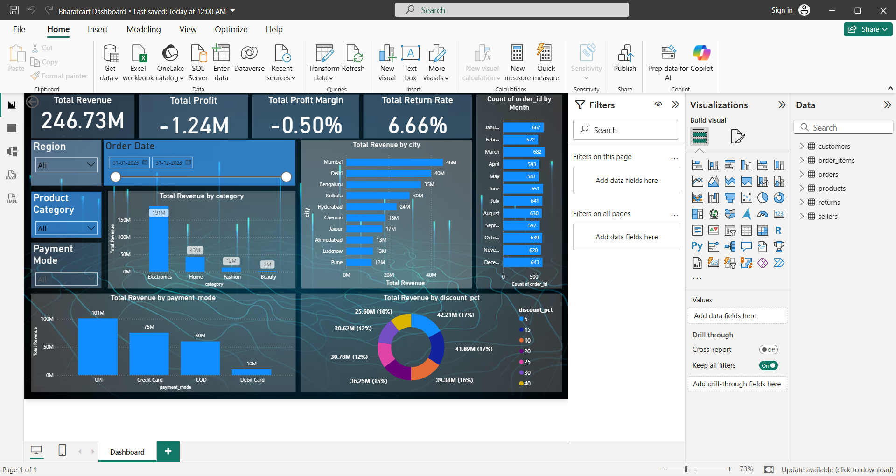

# BharatCart E-Commerce Analytics Project

A comprehensive data analytics project for analyzing e-commerce operations, customer behavior, and business performance for the BharatCart platform.

## Project Overview

This project contains raw transactional data, SQL database schema, and a Power BI dashboard for analyzing key business metrics including customer insights, order trends, seller performance, and returns analysis.

## Project Structure

```
first project/
├── 01_Raw Data/
│   ├── customers.csv          # Customer demographic and segment data
│   ├── orders.csv             # Order details and transaction information
│   ├── order_items.csv        # Itemized order data with products
│   ├── products.csv           # Product catalog with categories and pricing
│   ├── returns.csv            # Product return information
│   └── sellers.csv            # Seller information and ratings
├── 02_Sql/
│   └── final bharatcart.sql   # Database schema and SQL queries
├── 03_Dashboard/
│   └── Bharatcart Dashboard.pbix  # Power BI dashboard
├── 04_Dashboard bacground.avif    # Dashboard background image
└── README.md                      # This file
```

## Database Schema

### Tables

**customers**
- `customer_id` (INT, Primary Key): Unique customer identifier
- `gender` (VARCHAR): Customer gender
- `age` (INT): Customer age
- `segment` (VARCHAR): Customer segment classification
- `join_date` (DATE): Customer registration date

**products**
- `product_id` (INT, Primary Key): Unique product identifier
- `product_name` (VARCHAR): Product name
- `category` (VARCHAR): Product category
- `sub_category` (VARCHAR): Product sub-category
- `brand` (VARCHAR): Product brand
- `cost_price` (FLOAT): Product cost price

**sellers**
- `seller_id` (INT, Primary Key): Unique seller identifier
- `seller_name` (VARCHAR): Seller name
- `seller_city` (VARCHAR): Seller location (city)
- `rating` (FLOAT): Seller rating
- `commission_pct` (FLOAT): Commission percentage

**orders**
- `order_id` (INT, Primary Key): Unique order identifier
- `order_date` (DATE): Order placement date
- `customer_id` (INT, Foreign Key): Reference to customers table
- `city` (VARCHAR): Delivery city
- `state` (VARCHAR): Delivery state
- `region` (VARCHAR): Geographic region
- `payment_mode` (VARCHAR): Payment method
- `delivery_days` (INT): Delivery time in days
- `order_status` (VARCHAR): Current order status

**order_items**
- `order_id` (INT): Reference to orders table
- `product_id` (INT): Reference to products table
- `quantity` (INT): Quantity ordered

**returns**
- Returns data for analyzing product return patterns and reasons

## Getting Started

### Prerequisites
- SQL Server or MySQL database
- Power BI Desktop (for viewing/editing the dashboard)
- CSV file reader or spreadsheet application

### Setup Instructions

1. **Import Raw Data**: Load the CSV files from `01_Raw Data/` into your database or analytics tool
2. **Create Database**: Execute the SQL script in `02_Sql/final bharatcart.sql` to create the database schema
3. **Load Data**: Import the CSV files into the respective database tables
4. **View Dashboard**: Open `03_Dashboard/Bharatcart Dashboard.pbix` in Power BI Desktop

## Key Metrics & Analysis Areas

- **Customer Analytics**: Demographics, segmentation, and customer lifetime value
- **Order Analysis**: Order trends, regional performance, delivery metrics
- **Product Performance**: Category analysis, brand comparison, pricing analysis
- **Seller Insights**: Seller ratings, commission analysis, seller performance
- **Returns Analysis**: Return rates, reasons for returns, product quality insights

## Dashboard Features

The Power BI dashboard (`Bharatcart Dashboard.pbix`) provides:
- Interactive visualizations of key business metrics
- Customer segmentation and behavior analysis
- Order and sales trend analysis
- Seller performance tracking
- Return and quality metrics
- Geographic and regional insights


## Data Files Details

| File | Records | Purpose |
|------|---------|---------|
| customers.csv | Customer records | Customer demographics and segments |
| orders.csv | Order records | Transaction and order details |
| order_items.csv | Line items | Products ordered in each transaction |
| products.csv | Product catalog | Product information and categories |
| sellers.csv | Seller list | Seller information and metrics |
| returns.csv | Return records | Product returns and reasons |

## Usage

1. **For SQL Analysis**: Run queries from the SQL file to extract insights
2. **For Dashboard Viewing**: Open the Power BI file to explore interactive visualizations
3. **For Data Export**: Export CSV files to other analytics tools as needed

## Notes

- All dates are stored in DATE format
- Foreign key relationships are established between orders and customers
- Commission percentage is stored as a decimal value
- Delivery days represents the actual delivery time from order placement

## Future Enhancements

- Advanced predictive analytics for churn prediction
- Customer lifetime value (CLV) modeling
- Anomaly detection for fraud identification
- Supply chain optimization analysis

## License

Project data is for analytical and educational purposes.

---

**Last Updated**: March 2026
